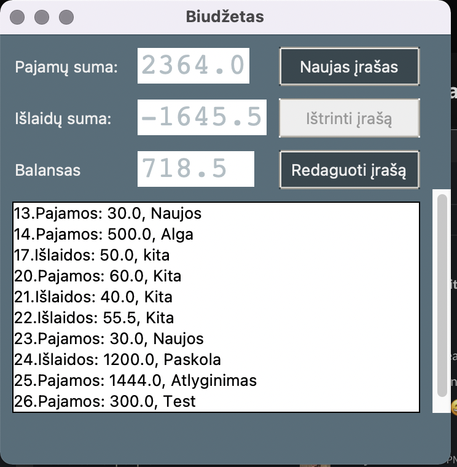
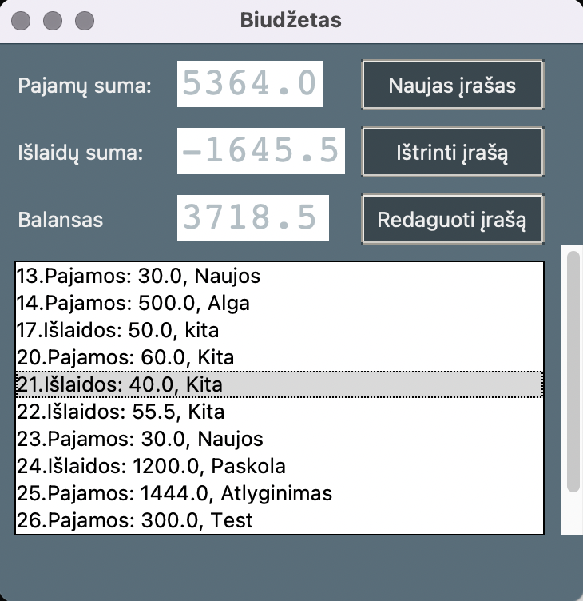
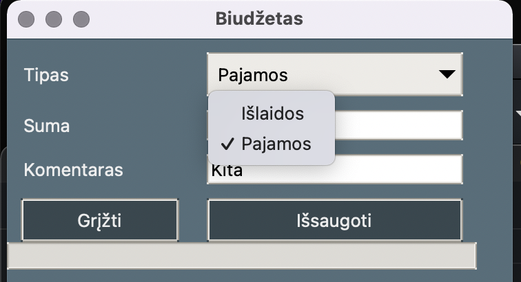
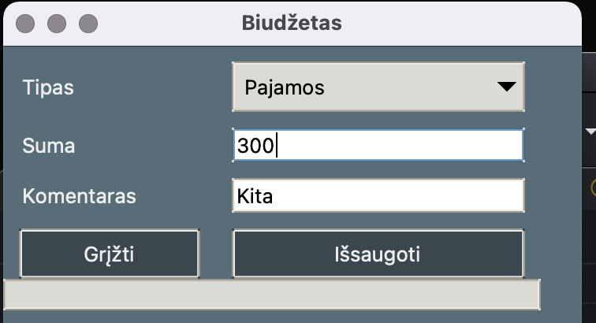
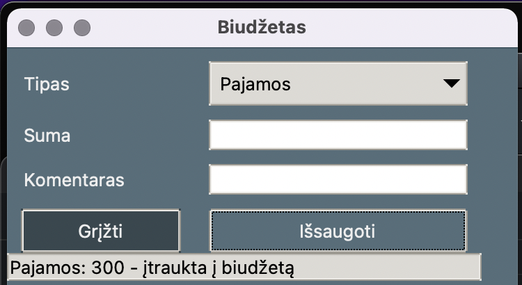
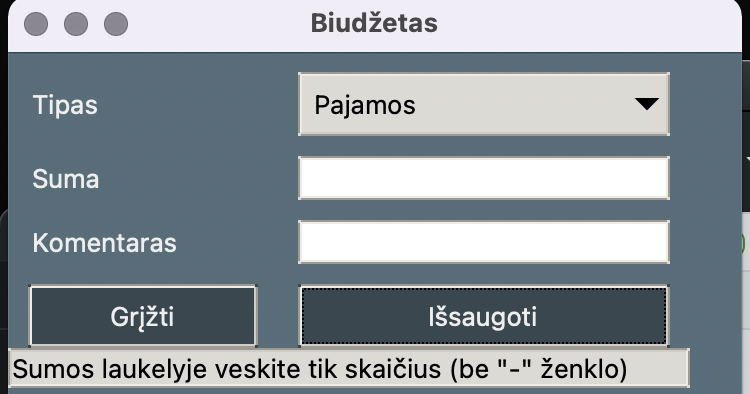
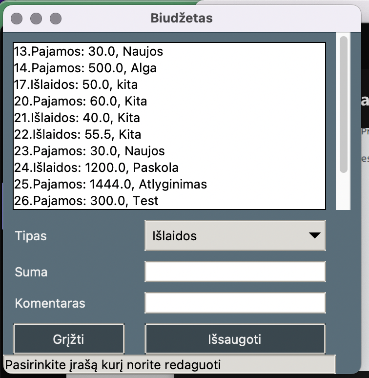
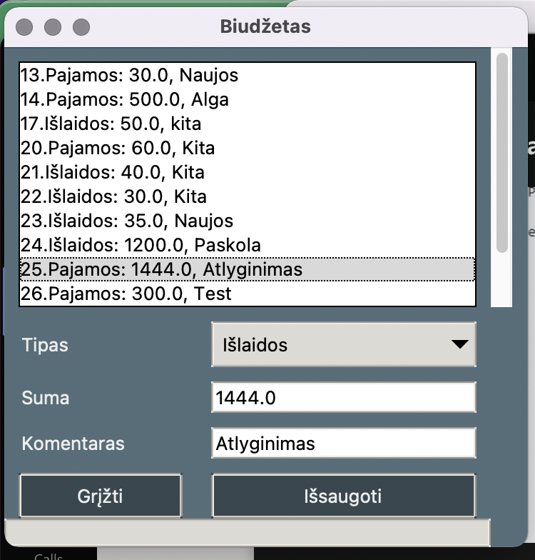
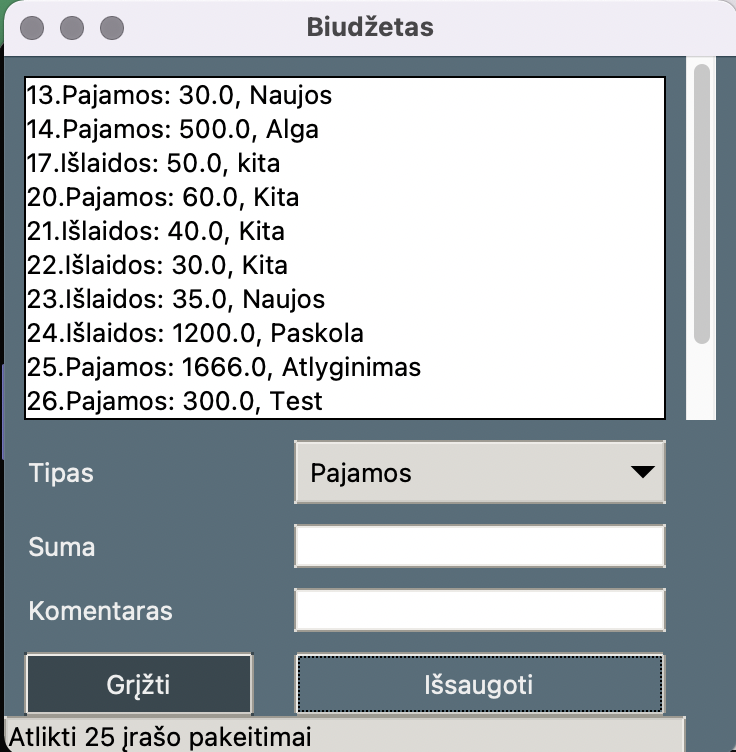

# Python pradedančiųjų kurso darbas - Biudžeto aplikacija

## Description

The app is used for loging income, expenses and the balance into the database.
While building the app I've deepened my knoweledge levels in GUI, it was really exciting to play with styles, different options for hovering over the button, swithcing frames, etc.

## Usage

At the top of the app frame the total of income, expenses and the balance fields represents sums of corresponding items.
The bottom frame shows all of the items that are currently added into the database. 

Delete button is inactive by default. The button activates only once an item from the list box is selected. By pressing the delete - the selected item will be removed from database, income, expenses and the balance fields will be recalculated automatically, the delete button will return to inactive state untill next item will be selected

Once ures press add new item button the app will swich to New_entry frame, there user will have menu option selections (1st image) for the type of item (in order to avoid any unidentified types of items). Once sum and comment will be added (2nd image) - status bar at the bottom will show item details and confirmation that the item was added to the list(3rd image).

   

If user adds anything rather than digit or . - error message will be represented at the status bar(4th image).

Once all of the items are added to the system - user can press return button it will take the user to the Main_window frame. 

New entries will be automatically represented in the income, expenses, balance and list blocks.

If needed user can edit any item by pressing the edit button.
At the top of the edit frame - system shows all of the items, status bar notifies that user needs to select item which should be updated 

Once user selects the item, status bar - clears and items' data is showed in corresponding fields

Once save button is hit - the item list updates automatically and status bar notifies the updated item ID.

Once all of the edits are made user can return to main frame by pressing return button, 

The end! 
