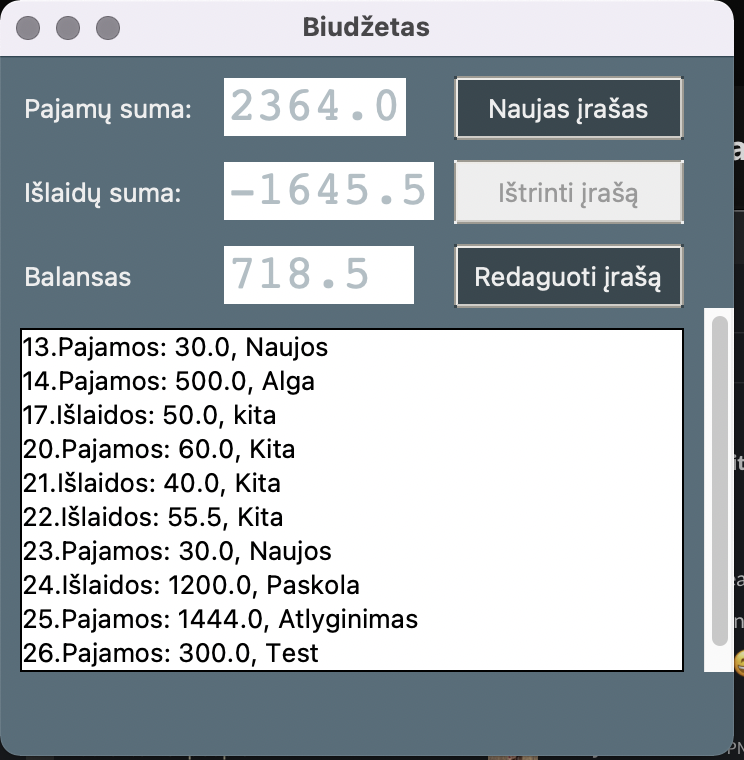

# Python pradedančiųjų kurso darbas - Biudžeto aplikacija

## Description

The app is used for loging personal expanses and income. 
While building the app I've deepened my knoweledge levels in GUI, it was really exciting to play with styles, different options for hovering over the button, swithcing frames, etc.


## Usage

From the main app frame You see the total of income, expances and the ballance. 
The bottom frame shows all of the items that are currently added into the database. 

    ```md
    
    ```
